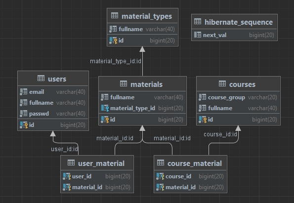

# FMI Materials

## Authors: Mario Nikolov and Georgi Boychev
## Faculty Numbers: 62392 and 62434

Course project for the "Web Development with Java" course

## Basic Business Requirements
- The user can create a course in the system. Every course has information about:
    - Group
    - Material type
    - Name
    - Etc
- The user should be able to see all courses in the system.
- The user should be able to search courses by name.
- The user should be able to see all available materials linked with the course.
    - This screen should show all material for this course.
    - The screen should have the possibility to search material by different criteria.
- The user should be able to add material to the course.
- The user should be able to create a list of courses.
- The user can modify/remove a list.

## Advanced Business Requirements
- Login page.
- Different roles for user and admin:
    - User can:
        - Screen for personal information.
        - Can add/modify/remove personal information.
        - Can create a list of favorite courses.
    - Admin:
        - Can add/modify/remove users.
        - Can add/modify/remove courses.
- Add an option for the user to edit his own details.
- Logout with a redirect to the login page.

## Database Overview

  

